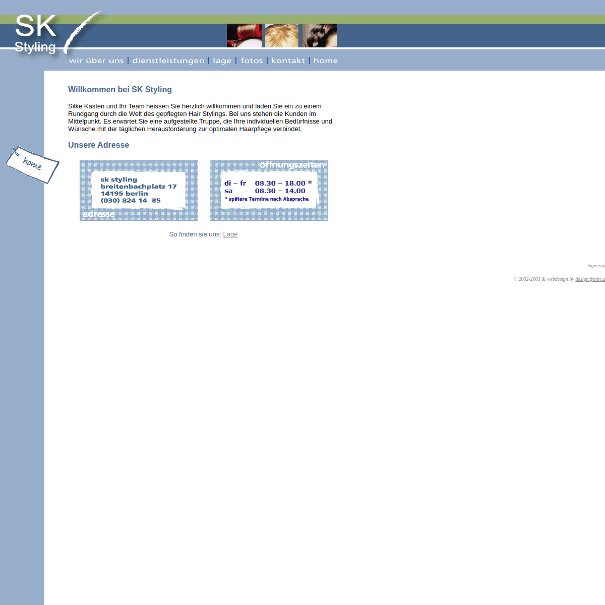
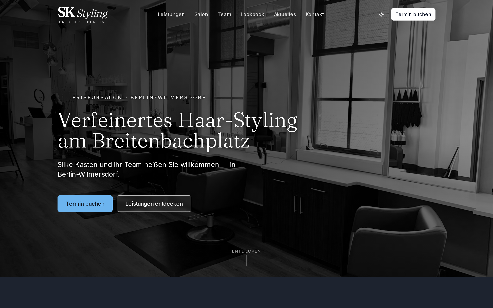
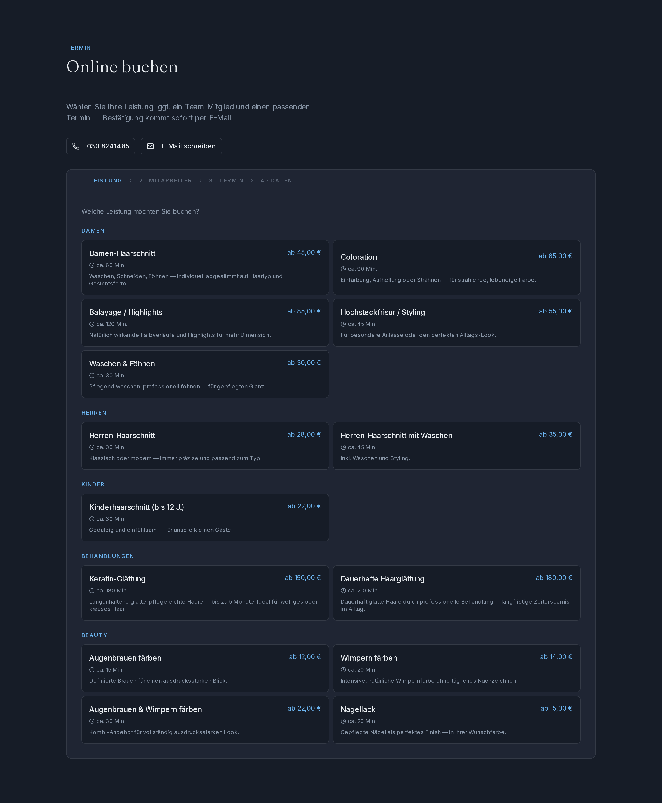
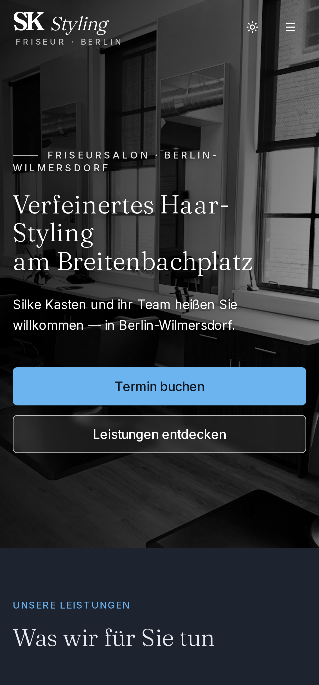

<!-- _class: cover -->

Pitch&nbsp;·&nbsp;Website-Relaunch

<h1 class="cover-h">SK&nbsp;Styling neu&nbsp;gedacht.</h1>

Ein Vorschlag zur Modernisierung Ihres Online-Auftritts am Breitenbachplatz&nbsp;— mobil, auffindbar und selbst pflegbar.

---

## Wer hier pitcht

// 00 Vorab

Kein Agentur-Apparat — ein fester Ansprechpartner. Ich bin <strong>Christian Koch</strong>, freiberuflicher Senior-Developer aus Berlin und baue seit über 15 Jahren Websites, Shops und CRM-Systeme.

Sonst für größere Marken im Einsatz — diesen Relaunch betreue ich vom ersten Entwurf bis zum Go-Live persönlich. Was Sie auf den nächsten Folien sehen, ist <strong>kein Mockup</strong>, sondern ein bereits lauffähiger Prototyp.

<h3>Was dieser Vorschlag enthält</h3>
<ul class="checks">
<li>Eine ehrliche Analyse der heutigen Website</li>
<li>Fünf konkrete Schwachstellen — und ihre Lösung</li>
<li>Einen fertigen, klickbaren Prototyp</li>
<li>Drei Pakete mit transparenten Festpreisen</li>
</ul>

<b>15+</b>JAHRE WEB-DEV

<b>1:1</b>ANSPRECHPARTNER

<b>0&nbsp;€</b>LAUFENDE KOSTEN

---

## Status Quo

// 01 Bestandsaufnahme

Die heutige Website unter <strong>sk-styling.de</strong> stammt aus den frühen 2000ern — sie funktioniert, transportiert aber nicht mehr, wofür SK Styling heute steht.

<h3>Drei Punkte fallen sofort auf</h3>
<ul class="problems">
<li>Nicht für Smartphones gemacht — Text winzig, Bedienung mühsam</li>
<li>Bildsprache und Layout wirken aus der Zeit gefallen</li>
<li>Kein Weg, online einen Termin zu sehen oder zu buchen</li>
</ul>

© 2002–2003 — seit über 20 Jahren unverändert

<i></i><i></i><i></i>sk-styling.de/home.html

Die Bestandssite — Stand heute

---

## Pain-Point 1 — Mobil

// 02 Das Problem

!

<strong>Über 70 % aller Anfragen kommen heute vom Smartphone.</strong>

Die aktuelle Seite hat dafür keine Antwort:

<ul class="problems">
<li>Keine responsive Layout-Logik</li>
<li>Schrift wird beim Zoomen unleserlich</li>
<li>Schaltflächen zu klein für den Daumen</li>
<li>Kein „Tippen zum Anrufen"</li>
</ul>

Potenzielle Neukundinnen springen ab, bevor sie überhaupt die Telefonnummer entdeckt haben.

Lösung

<h3>Was wir liefern</h3>
<ul class="checks">
<li>Mobile-First-Design — getestet auf iPhone &amp; Android</li>
<li>Tap-to-Call-Leiste am unteren Bildschirmrand</li>
<li>Touch-optimierte Slots im Buchungs-Flow</li>
<li>Schrift &amp; Buttons in daumentauglicher Größe</li>
</ul>

---

## Pain-Point 2 — Auffindbarkeit

// 03 Das Problem

!

<strong>Bei „Friseur Breitenbachplatz" rangiert die Seite weit hinten bei Google.</strong>

<ul class="problems">
<li>Lange Ladezeiten (geschätzter Lighthouse-Score &lt; 50)</li>
<li>Keine strukturierten Daten (Schema.org)</li>
<li>Keine Sitemap, keine semantischen Überschriften</li>
<li>Bilder für Google nicht indexierbar</li>
</ul>

Wer nicht gefunden wird, existiert online nicht.

Lösung

<h3>Was wir liefern</h3>
<ul class="checks">
<li>Lighthouse-Ziel ≥ 95 in allen vier Kategorien</li>
<li>Schema.org-Markup: Adresse, Öffnungszeiten, Geo</li>
<li>Sitemap &amp; robots.txt sauber konfiguriert</li>
<li>Bilder über CDN, automatisch komprimiert</li>
<li>Edge-Hosting in Frankfurt — niedrige Latenz</li>
</ul>

---

## Pain-Point 3 — Selbst pflegen

// 04 Das Problem

!

<strong>Heute ist jede Preisänderung ein Anruf beim Entwickler.</strong>

<ul class="problems">
<li>News &amp; Aktionen nicht spontan ankündbar</li>
<li>Galerie-Bilder müssen manuell ausgetauscht werden</li>
<li>Saison-Aktionen gehen schlicht unter</li>
</ul>

Eine Website, die man nicht selbst pflegen kann, veraltet ab dem ersten Tag.

Lösung

<h3>Was wir liefern</h3>
<ul class="checks">
<li>Voll-CMS auf Basis von Sanity — direkt im Browser</li>
<li>Preise, Texte, Fotos in 2 Minuten geändert</li>
<li>News-Beiträge mit Ablaufdatum</li>
<li>Mehrere Nutzer:innen parallel</li>
<li>Versionierung &amp; Rückgängig eingebaut</li>
</ul>

---

## Pain-Point 4 — Rechtssicherheit

// 05 Das Problem

§

<strong>Datenschutzerklärung und Impressum sind veraltet oder fehlen.</strong>

<ul class="problems">
<li>Abmahnrisiko durch spezialisierte Kanzleien</li>
<li>Bußgeld bei DSGVO-Verstoß</li>
<li>Vertrauensverlust bei modernen Kund:innen</li>
</ul>

Lösung

<h3>Was wir liefern</h3>
<ul class="checks">
<li>DSGVO-konforme Datenschutzerklärung als Mustertext</li>
<li>Impressum nach § 5 TMG</li>
<li>Cookie-frei wo möglich — kein Tracking</li>
<li>Empfehlung: anwaltliche Prüfung vor Go-Live — wir liefern die Vorlagen</li>
</ul>

---

## Pain-Point 5 — Termine

// 06 Das Problem

‣

<strong>Telefonisch buchen ist Standard — aber längst nicht mehr Erwartung.</strong>

<ul class="problems">
<li>Jüngere Kundschaft erwartet Online-Buchung</li>
<li>Telefonzeiten kollidieren mit Arbeitszeiten</li>
<li>Fresha als Drittanbieter ist nicht mehr aktiv</li>
</ul>

Lösung

<h3>Was wir liefern</h3>
<ul class="checks">
<li>Eigenes Buchungssystem — kein monatliches Abo</li>
<li>Echtzeit-Verfügbarkeit aus den Öffnungszeiten</li>
<li>Mitarbeiter-Auswahl, jede Person eigener Kalender</li>
<li>Bestätigungs-Mail mit Kalender-Datei</li>
<li>Stornierung per Link — kein Anruf nötig</li>
</ul>

---

## Die Vision

// 07 Wie es aussehen kann

<h2 class="serif" style="font-size:25px;line-height:1.25;">Ein durchdachter Eindruck — vom ersten Scroll bis zur Terminbestätigung.</h2>

<ul class="checks">
<li>Großflächige, atmosphärische Bildsprache</li>
<li>Klar lesbare Preise &amp; Leistungen</li>
<li>Heller oder dunkler Modus je nach Tageszeit</li>
<li>Ein klarer Handlungsaufruf: „Termin buchen"</li>
</ul>

Alles unter Ihrer eigenen Marke — keine Vorlagen, keine Templated-Optik.

<i></i><i></i><i></i>sk-styling.de

Prototyp · lauffähig &amp; klickbar

---

## Online buchen

// 08 Das Herzstück

<h2 class="serif" style="font-size:25px;line-height:1.25;">In vier Schritten zum Termin — Tag und Nacht.</h2>

<ul class="checks">
<li>Leistung wählen — mit Dauer &amp; Preis</li>
<li>Mitarbeiter:in auswählen (oder „egal")</li>
<li>Freien Termin aus dem Live-Kalender picken</li>
<li>Kontaktdaten — Bestätigung kommt sofort per Mail</li>
</ul>

Kein Drittanbieter, kein monatliches Abo — das System gehört zur Website.

<i></i><i></i><i></i>sk-styling.de/#booking

Buchungs-Flow · Schritt 1 von 4

---

## Mobil zuerst gedacht

// 09 Smartphone-Ansicht

<h2 class="serif" style="font-size:25px;line-height:1.25;">Dort gestaltet, wo der Daumen es erwartet.</h2>

Der Prototyp ist für 375–430&nbsp;px Breite entworfen und skaliert von dort nach oben — nicht umgekehrt.

<ul class="checks">
<li>Tap-to-Call direkt erreichbar</li>
<li>Touch-optimierte Slots im Buchungs-Flow</li>
<li>Sofort lesbare Preise &amp; Leistungen</li>
</ul>

---

## Tech-Stack — kurz erklärt

// 10 Das Fundament

<h3>Next.js + Vercel</h3>

Serverseitig vorgerendert, ausgeliefert von Edge-Servern in Frankfurt. Ladezeiten unter einer Sekunde — auch im Mobilfunknetz.

<h3>Sanity CMS</h3>

Ein eingebautes Studio erlaubt jede Inhaltsänderung selbst — direkt im Browser. Kein Entwickler nötig.

<h3>DSGVO-Stack</h3>

Alle Datenflüsse in der EU oder vertraglich abgesichert. Mailversand &amp; optionale Zahlungen DSGVO-konform.

0&nbsp;€&nbsp;/&nbsp;Monat

<strong>Laufende Kosten: 0&nbsp;€.</strong> Vercel Hobby, Sanity Free und der Mailversand decken den Bedarf einer Salon-Site komplett ab — lediglich die Domain (~12&nbsp;€/Jahr) fällt an.

---

## Drei Pakete zur Auswahl

// 11 Transparente Festpreise

Paket A

<h3>Starter</h3>

390 €

einmalig, netto · ~2 Wochen

<ul class="checks">
<li>Komplettes Redesign, mobile-first</li>
<li>Sanity-CMS zur Pflege</li>
<li>Impressum + Datenschutz</li>
<li>SEO-Basis + Schema.org</li>
<li>Vercel-Hosting eingerichtet</li>
</ul>

Paket B · empfohlen

<h3>Pro</h3>

790 €

einmalig, netto · ~4–5 Wochen

<ul class="checks">
<li>Alles aus Starter</li>
<li>Online-Buchungssystem</li>
<li>Mitarbeiter-Auswahl &amp; Sperrzeiten</li>
<li>Bestätigungs-Mails mit Kalender-Datei</li>
<li>Self-Service-Stornierung</li>
</ul>

Paket C

<h3>Premium</h3>

1.190 €

einmalig, netto · ~6–8 Wochen

<ul class="checks">
<li>Alles aus Pro</li>
<li>Anzahlung gegen No-Shows</li>
<li>Drag-&amp;-Drop-Kalender im Admin</li>
<li>Wiederkehrende Sperrzeiten</li>
<li>Lookbook mit Lightbox</li>
</ul>

---

## Was nicht im Preis enthalten ist

// 12 Ehrlich dazugesagt

Damit es keine Überraschungen gibt — optionale Posten, transparent aufgeführt:

<ul class="problems">
<li><strong>Domain</strong> — behalten oder neu, ~12–15 €/Jahr</li>
<li><strong>Profi-Fotoshooting</strong> im Salon — extern, ~300–600 €</li>
<li><strong>DSGVO-Anwaltsprüfung</strong> der Texte — ~150–300 €, empfohlen</li>
<li><strong>Wartung</strong> nach Go-Live — ~30 €/Monat, optional</li>
</ul>

SSL-Zertifikat: in Vercel enthalten — 0 €.

<h3>Bereits vorbereitet</h3>
<ul class="checks">
<li>Voll funktionsfähige Demo unter einer Vorschau-URL</li>
<li>Originaltexte &amp; Adresse von der Bestandssite übernommen</li>
<li>Logo-Vorschlag auf Basis Ihrer aktuellen Marke</li>
<li>Stock-Bilder als Platzhalter — durch echte Fotos ersetzbar</li>
<li>Beispiel-Buchungen im CMS für die Demo</li>
</ul>

---

## Roadmap nach Auftrag

// 13 Vier Schritte zum Go-Live

1

<b>Woche 1</b> &nbsp;—&nbsp; Kickoff-Termin, Marken-Abstimmung (Farben, Schriften, Tonalität), Auswahl der Bilder.

2

<b>Woche 2</b> &nbsp;—&nbsp; Inhalte ins CMS einpflegen, Preise &amp; Team-Daten sammeln, Anwaltsprüfung anstoßen.

3

<b>Woche 3</b> &nbsp;—&nbsp; Buchungssystem konfigurieren (Pro/Premium), Zahlungen einrichten (Premium), Testläufe.

4

<b>Woche 4+</b> &nbsp;—&nbsp; Soft-Launch auf temporärer URL, Korrekturschleife, dann Domain-Umzug und Go-Live.

---

<!-- _class: close -->

// 14 Nächster Schritt

<h1 style="font-size:38px;">Lassen Sie uns reden.</h1>

Schauen Sie sich die Demo in Ruhe an — ich freue mich auf Ihre Rückmeldung und beantworte gern jede Frage.

<strong style="color:#f2f2f2;">Christian Koch</strong> 
koch@code-k.info&nbsp; ·&nbsp; devs.berlin 
‹ CODE·K › — freiberufliche Web-Entwicklung, Berlin

<strong style="color:#f2f2f2;">Demo live ansehen</strong> QR scannen oder URL eintippen

